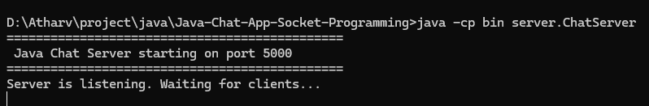
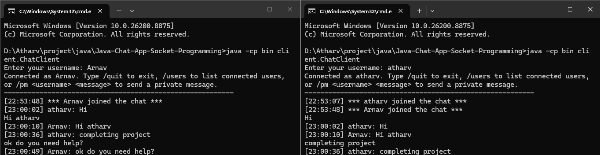

# Java Chat App — Socket Programming & Multithreading

**By Atharv Bunde** — Mechatronics Engineering student

A real-time, multi-client chat application built in core Java using **TCP sockets** and **multithreading**, with no external frameworks or libraries. It runs entirely on `localhost`, so it needs no server hosting, cloud account, or internet access — only a JDK.

> Built as a course/portfolio project to demonstrate client-server architecture, socket programming, and concurrent thread handling in Java.

---

## 1. Overview

**What it is:** a console (and optional Swing GUI) chat client-server system. One server process accepts connections from many client processes and relays ("broadcasts") every message to all connected users in real time, similar in spirit to how messaging platforms, live-support widgets, and multiplayer game lobbies route messages between users through a central server.

**Problem it solves:** demonstrates, from first principles, how multiple independent programs on a network exchange real-time data through a shared server — the same fundamental pattern (sockets + threads + a message broker) that sits underneath production messaging, notification, and multiplayer systems.

### How it works, simply
Every client opens a connection to one server. Whenever a client types a message, it's sent to the server, and the server forwards it to everyone else who's connected — like a group phone call where one operator (the server) relays what each person says to the rest of the group.

### How it works, technically
- The server opens a `ServerSocket` and blocks on `accept()` in a loop.
- Each accepted `Socket` is handed to a new **thread** (`ClientHandler`), so the server can service many clients concurrently without one slow/blocked client stalling the others.
- Each `ClientHandler` reads lines from its client's `InputStream` (via `BufferedReader`) and writes to a shared, thread-safe collection of handlers to broadcast messages via each client's `OutputStream` (via `PrintWriter`).
- The client itself is also two-threaded: the **main thread** reads keyboard input and sends it to the server, while a **background thread** continuously reads incoming server messages so the client can receive messages at any time without blocking on user input.

```
   Client 1        Client 2        Client 3
      |               |               |
      |   Socket       |   Socket      |   Socket
      +---------------\|/--------------+
                        |
                  Java ServerSocket
                        |
        +---------------+---------------+
        |               |               |
  ClientHandler   ClientHandler   ClientHandler
     (Thread 1)      (Thread 2)      (Thread 3)
        |               |               |
        +------- shared client set -----+
                        |
              Message Broadcasting
                        |
             Real-time chat output
                (+ persisted log file)
```

---

## 2. Industry Relevance

The same core pattern — a persistent socket connection, a server that fans a message out to many recipients, and one thread (or event loop) per connection — underlies:

- **Messaging systems** (Slack, WhatsApp-style backends)
- **Live customer-support chat widgets**
- **Multiplayer game servers** (position/event broadcasting)
- **Collaboration tools** (shared cursors, live comments)
- **Real-time notification systems** (push updates to many clients)
- **Distributed systems** generally, where nodes must exchange state over a network reliably

**Why this still matters in an AI-driven era:** modern AI products are not just models — they're backends. Every AI chat product, agent platform, or real-time AI assistant still needs a reliable networking layer, concurrent request handling, session management, and message routing exactly like this project demonstrates. Java remains widely used for exactly these layers: enterprise backends, Android apps, and scalable server-side systems that call out to AI/ML APIs. Understanding sockets and threads is what lets you reason correctly about latency, concurrency bugs, and scaling once you're gluing an LLM API into a real multi-user product.

---

## 3. Java Concepts Demonstrated

| Concept | Role in this project |
|---|---|
| `Socket` / `ServerSocket` | Establish and accept TCP connections between client and server |
| `InputStream` / `OutputStream` | Raw byte-level channels underlying all socket communication |
| `BufferedReader` | Efficiently reads line-based text from a socket's input stream |
| `PrintWriter` | Sends line-based text to a socket's output stream, with `autoFlush` |
| `Thread` / `Runnable` | One thread per client connection (`ClientHandler implements Runnable`); a background listener thread in each client |
| `ExecutorService` (cached thread pool) | Manages server-side client-handler threads instead of raw `new Thread()` calls |
| `synchronized` blocks / thread-safe `Set` | Protects the shared collection of connected clients from race conditions during broadcast |
| Exception handling (`try-with-resources`, `catch IOException`) | Graceful handling of disconnects, refused connections, and port conflicts |
| OOP design | `Message`, `ChatLogger`, `ClientHandler`, `ChatServer`, `ChatClient` each have a single clear responsibility |
| Java Swing (optional) | `ChatClientGUI` — event-driven GUI client using the same protocol |

---

## 4. Features

**Implemented (mandatory + recommended):**
- Start a chat server on a configurable port
- Connect any number of clients concurrently
- Username entry with duplicate-name rejection
- Real-time message broadcasting to all connected clients
- Join / leave notifications
- Private messaging: `/pm <username> <message>`
- Active user list: `/users`
- Graceful disconnect: `/quit`
- Timestamped chat history persisted to `logs/chat.log`
- Robust error handling (port already in use, connection refused, client dropped mid-session)
- Optional Java Swing GUI client (`gui.ChatClientGUI`) using the identical protocol

**Not implemented (documented as future work):** chat rooms, file sharing, database-backed accounts, encryption/TLS. See [Future Improvements](#9-limitations--future-improvements).

---

## 5. Folder Structure

```
Java-Chat-App-Socket-Programming/
│
├── src/
│   ├── server/
│   │   ├── ChatServer.java      # accepts connections, owns the thread pool
│   │   └── ClientHandler.java   # one thread per client; broadcast + private msg + commands
│   ├── client/
│   │   └── ChatClient.java      # console client (2 threads: input + listener)
│   ├── common/
│   │   ├── Message.java         # shared message model + display formatting
│   │   └── ChatLogger.java      # thread-safe append-only chat history logger
│   └── gui/
│       └── ChatClientGUI.java   # optional Swing GUI client
│
├── logs/                        # chat.log is written here at runtime (gitkeeped, log ignored)
├── screenshots/                 # place proof-of-work screenshots here for GitHub
├── docs/
│   └── PROJECT_GUIDE.md         # architecture, testing, GitHub strategy, interview prep
├── test/
│   ├── support/                 # dependency-free assertion helpers + reflection-based TestRunner
│   ├── common/                  # unit tests for Message and ChatLogger (incl. concurrency stress test)
│   └── integration/             # real socket-level end-to-end test against a live ChatServer
├── docker/
│   └── Dockerfile               # multi-stage build for the server
├── docker-compose.yml           # `docker compose up --build` to run the server in a container
├── .github/workflows/java-ci.yml # GitHub Actions: compiles + runs the full test suite on every push
├── README.md
└── .gitignore
```

---

## 6. How to Run

### Requirements
- JDK 11 or later (tested on JDK 21)
- No external dependencies, no internet connection needed

### A. Command line

```bash
# From the project root:

# 1. Compile everything
javac -d bin src/common/*.java src/server/*.java src/client/*.java src/gui/*.java

# 2. Start the server (default port 5000)
java -cp bin server.ChatServer
#   or on a custom port:
java -cp bin server.ChatServer 5001

# 3. In separate terminals, start as many clients as you like
java -cp bin client.ChatClient
java -cp bin client.ChatClient localhost 5000

# 4. Optional: start the Swing GUI client instead of the console client
java -cp bin gui.ChatClientGUI
```

**Default host:** `localhost`  •  **Default port:** `5000`

**Port already in use?** Either stop whatever is using port 5000, or start the server with a different port: `java -cp bin server.ChatServer 5001` (and point clients at the same port).

### B. IntelliJ IDEA
1. `File → New → Project from Existing Sources` and select this folder.
2. Mark `src` as **Sources Root** (right-click → *Mark Directory as* → *Sources Root*).
3. Right-click `server/ChatServer.java` → **Run**.
4. Right-click `client/ChatClient.java` → **Run** (repeat, using *Run → Edit Configurations → Allow multiple instances*, for each additional client).

### C. Eclipse
1. `File → New → Java Project`, then import the `src` folder as the source folder.
2. Right-click `ChatServer.java` → **Run As → Java Application**.
3. Right-click `ChatClient.java` → **Run As → Java Application** (repeat for multiple clients; Eclipse allows multiple concurrent launches of the same class).

### Demo Screenshots

| Compiling the project | Running the server | Running a client |
|---|---|---|
|  |  |  |

### Sample session
```
Server console:
==============================================
 Java Chat Server starting on port 5000
==============================================
Server is listening. Waiting for clients...
New connection from /127.0.0.1:53820
New connection from /127.0.0.1:53824

Client (Alice):
Enter your username: Alice
Connected as Alice. Type /quit to exit, /users to list connected users,
or /pm <username> <message> to send a private message.
----------------------------------------------------------
[20:25:19] *** Alice joined the chat ***
[20:25:19] Alice: Hello everyone!
[20:25:20] *** Bob joined the chat ***
[20:25:20] Bob: Hi Alice!
```

This exact transcript was captured from a real automated two-client test run during development (see `docs/PROJECT_GUIDE.md` → Testing Strategy).

---

## 7. Testing

The project ships with a real, runnable, dependency-free test suite — no JUnit jar or Maven required, just the JDK:

```bash
# Compile app + tests, then run everything
javac -d bin src/common/*.java src/server/*.java src/client/*.java src/gui/*.java
javac -d testbin -cp bin test/support/*.java test/common/*.java test/integration/*.java
java -cp bin:testbin support.TestRunner
```

This runs:
- **Unit tests** for `Message` formatting (all 5 message types) and `Message` getters
- **`ChatLogger` tests**, including a genuine 20-thread / 500-message concurrency stress test that asserts no log line is ever lost or corrupted
- **Real socket integration tests** that start an actual `ChatServer` on an ephemeral port and drive it with real `Socket` connections — verifying broadcast delivery, duplicate-username rejection, and private-message delivery end-to-end (not mocked)

All 11 tests pass on every push via the GitHub Actions workflow at `.github/workflows/java-ci.yml`.

See [`docs/PROJECT_GUIDE.md`](docs/PROJECT_GUIDE.md) for the full manual test matrix (sudden disconnects, empty messages, rapid messaging, server shutdown, port conflicts, etc.).

## 7b. Running with Docker

```bash
docker compose up --build
```

This builds the server via `docker/Dockerfile` (multi-stage: compiles with a JDK image, then runs on a slim JRE image) and exposes port `5000`, with `logs/` mounted as a volume so chat history persists outside the container. Connect clients from your host machine as usual:

```bash
java -cp bin client.ChatClient localhost 5000
```

(The console/GUI clients are interactive and are run on the host, not containerized.)

---

## 8. Screenshots

### Run the Server


### Run the Client

---

## 9. Limitations & Future Improvements

**Current limitations:**
- No authentication/persistence — usernames are not remembered between sessions.
- No encryption — traffic is plain text, suitable for local learning only.
- Single chat room — everyone connected shares the same room.
- No database — chat history is a flat log file, not a queryable store.

**Planned improvements:**
- Multiple chat rooms / channels
- Login system backed by a database (JDBC + MySQL/SQLite)
- File sharing over sockets
- TLS-secured sockets (`SSLSocket`)
- Online/offline presence indicators
- Dockerized deployment for a real (non-localhost) demo

---

## 10. Learning Outcomes

Building this project reinforces:
- TCP client-server communication with raw Java sockets
- Designing and reasoning about multithreaded, concurrent server code
- Safe sharing of mutable state across threads (`synchronized`, thread-safe collections)
- Building a simple text-based application-layer protocol
- Structuring a multi-class Java project cleanly (`server` / `client` / `common` / `gui`)
- Writing an optional GUI on top of an existing network protocol

---

## Author

**Atharv Bunde**
Mechatronics Engineering student, exploring backend development and networking through hands-on Java projects.

Built as a Java networking & concurrency portfolio project. Contributions and suggestions welcome via issues/PRs.
